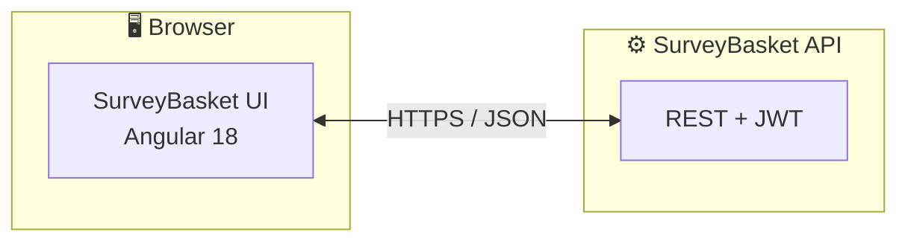
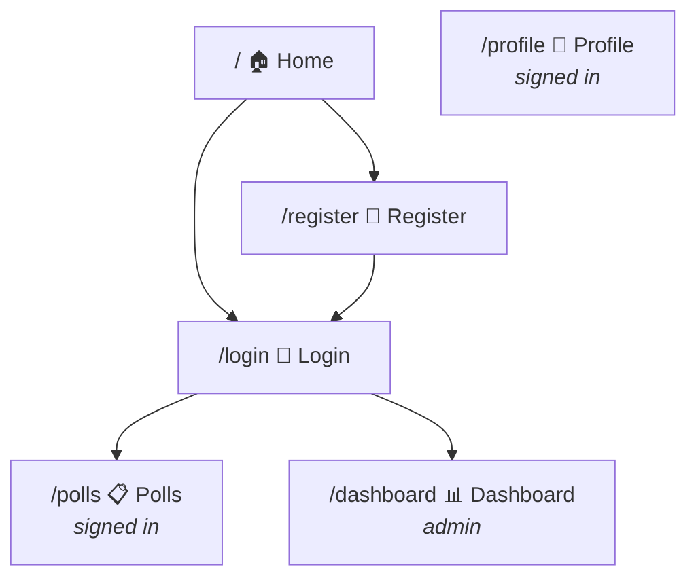
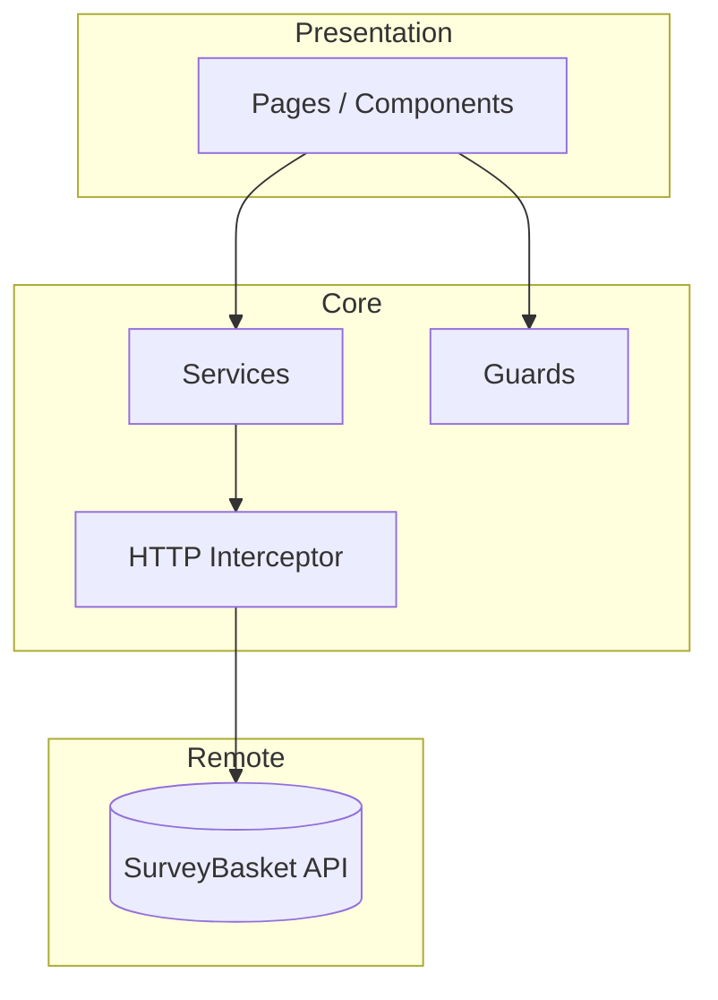
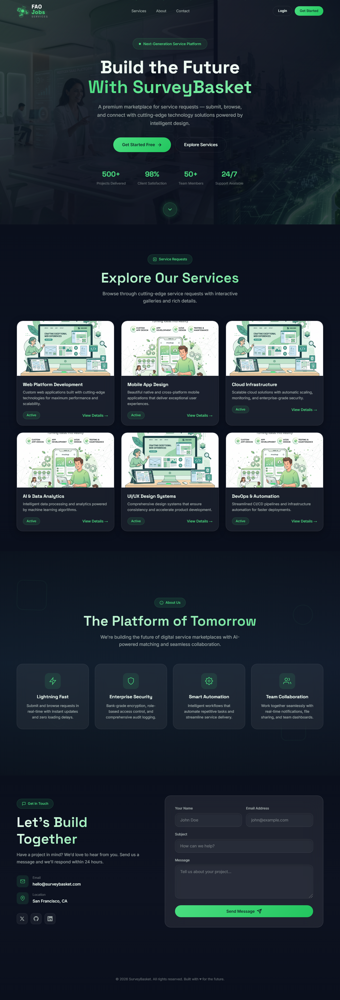
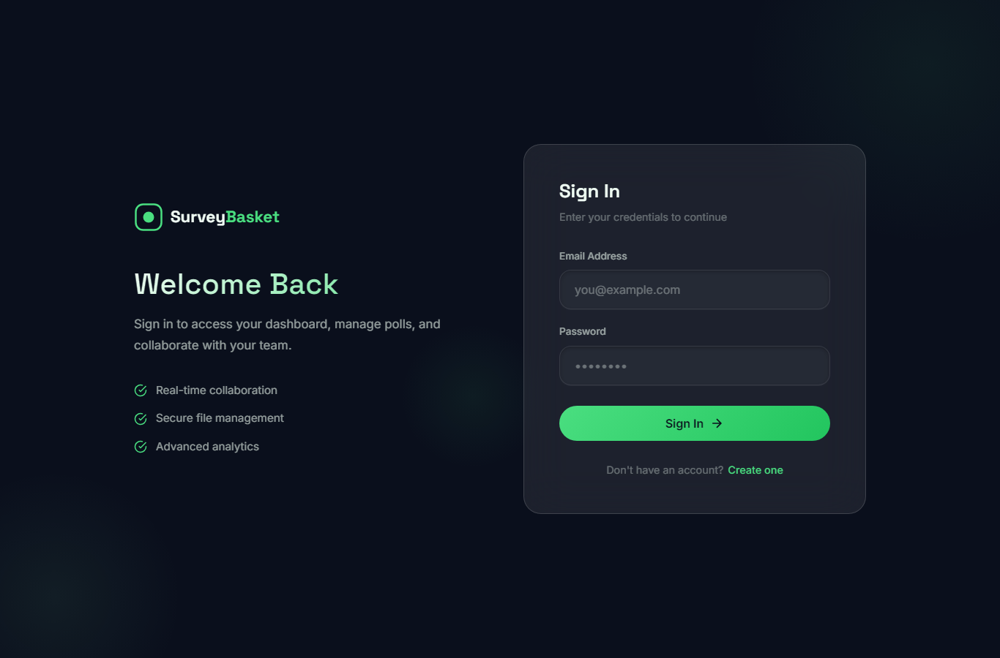
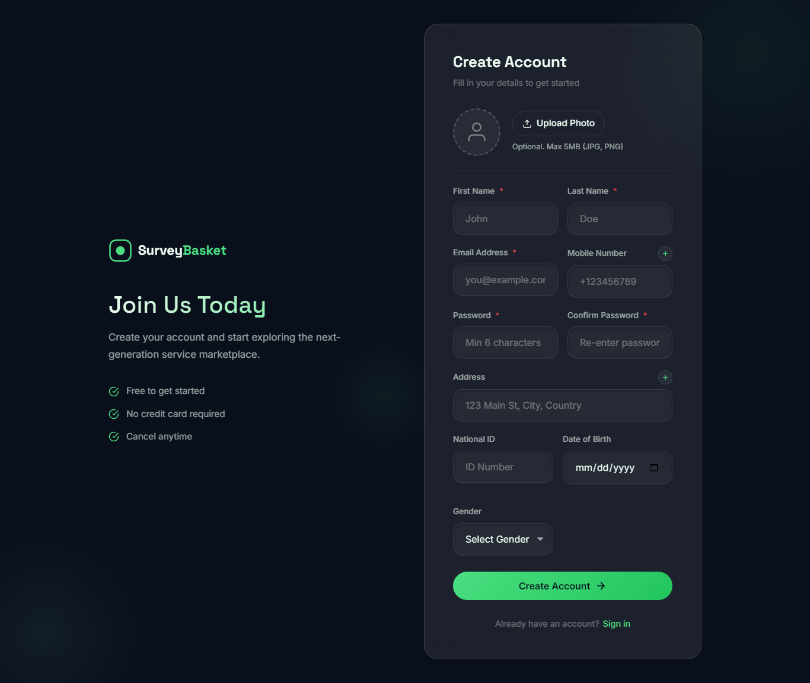

# SurveyBasket UI

[](https://angular.dev/)
[](https://www.typescriptlang.org/)
[]()

> **SurveyBasket UI** is the front-end for **SurveyBasket** — an Angular single-page application for managing polls, client profiles, and an admin dashboard. It talks to the SurveyBasket REST API over HTTPS, uses JWT authentication, and protects routes with role-aware guards.

---

## Table of contents

| | Section |
|---|---------|
| 🎯 | [Overview](#overview) |
| ✨ | [Key features](#key-features) |
| 🏗️ | [Architecture](#architecture) |
| 📁 | [Project layout](#project-layout) |
| 🚀 | [Getting started](#getting-started) |
| 📸 | [Screenshots & tour](#screenshots--tour) |
| 🛠️ | [Scripts & capture](#scripts--capture) |

---

## Overview

- **What it does:** Presents a public landing experience, sign-in and registration, authenticated poll browsing and profile management, and a **dashboard** area for administrators (protected by `adminGuard`).
- **Backend:** Configured in [`src/app/core/config/api.config.ts`](src/app/core/config/api.config.ts) (default `https://localhost:7270`). Adjust this to match your API host (e.g. `applicationUrl` in the backend `launchSettings.json`).
- **Auth:** HTTP client uses an [`authInterceptor`](src/app/core/interceptors/auth.interceptor.ts) so API calls include the JWT where needed. [`jwt-decode`](https://github.com/auth0/jwt-decode) supports token inspection on the client.



---

## Key features

| Area | Description |
|------|-------------|
| 🏠 **Home** | Marketing / entry routes for guests. |
| 🔐 **Login / Register** | Credential flows against the auth API. |
| 📊 **Dashboard** | Admin-only analytics and management (`adminGuard`). |
| 📋 **Polls** | List and interact with polls (`authGuard`). |
| 👤 **Profile** | Client profile and related data (`authGuard`). |
| 🔔 **Toasts** | User feedback via [`ngx-toastr`](https://www.npmjs.com/package/ngx-toastr). |

**Route map (simplified):**



---

## Architecture

| Layer | Role |
|-------|------|
| 📱 **Pages** | Lazy-loaded route components (`home`, `login`, `register`, `dashboard`, `polls`, `profile`). |
| 🧩 **Core** | `services`, `guards`, `interceptors`, `config`, `models`. |
| 🔗 **Shared** | Reusable UI such as header/navigation. |



---

## Project layout

```
src/app/
├── core/           # API config, guards, interceptors, services, models
├── pages/          # Route-level feature modules (lazy loaded)
├── shared/         # Shared components
├── app.routes.ts   # Route definitions
└── app.config.ts   # App providers (router, HTTP, animations, toastr)
```

Static media for docs and demos lives under **`public/assets/images/web/recordings/`** (screenshots + optional screen recording).

---

## Getting started

**Prerequisites:** [Node.js](https://nodejs.org/) (LTS recommended), npm, and the SurveyBasket API running if you need live data.

```bash
npm install
npm start
```

Open **http://localhost:4200/**. The dev server reloads on file changes.

**Production build:**

```bash
npm run build
```

Artifacts are emitted under `dist/`.

---

## Screenshots & tour

Full-page captures and a short **WebM tour** are stored in:

`public/assets/images/web/recordings/`

| Screen | File | Preview |
|--------|------|---------|
| 🏠 Home | `ui-home.png` |  |
| 🔐 Login | `ui-login.png` |  |
| 📝 Register | `ui-register.png` |  |
| 📊 Dashboard | `ui-dashboard.png` |  |
| 📋 Polls | `ui-polls.png` |  |
| 👤 Profile | `ui-profile.png` |  |

**Video tour:** [`surveybasket-ui-tour.webm`](./public/assets/images/web/recordings/surveybasket-ui-tour.webm) — recorded during the same capture session as the screenshots above.

---

## Scripts & capture

| Command | Purpose |
|---------|---------|
| `npm start` | Dev server (`ng serve`). |
| `npm run build` | Production build. |
| `npm test` | Unit tests (Karma). |
| `npm run capture:ui` | Playwright script: full-page PNGs + WebM under `public/assets/images/web/recordings/`. Requires **`npm start`** first on `http://localhost:4200`. |

This project was generated with [Angular CLI](https://github.com/angular/angular-cli) **18.2.19**. For CLI help: `ng help` or the [Angular CLI docs](https://angular.dev/tools/cli).

---

## Further help

- **End-to-end tests:** `ng e2e` requires adding an e2e runner package first.
- **Code scaffolding:** `ng generate component|directive|pipe|service|class|guard|interface|enum|module <name>`
